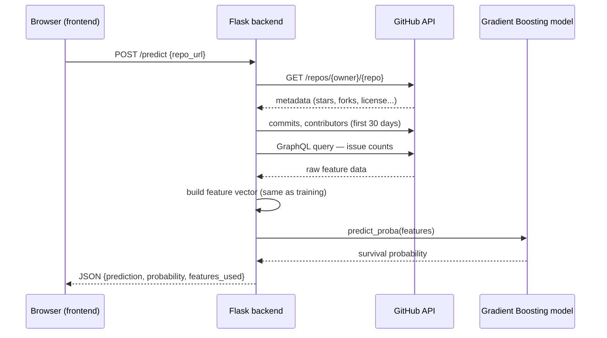

# OSS Pulse: predicting the survival of GitHub repositories

DATA11001 Data Science — University of Helsinki
Rubén Somavilla

---

## 1. Introduction

Most repositories published on GitHub never really take off: they get
created, see some activity at the start, and are then abandoned without
anyone touching them again. This project starts from a specific
question: can we tell, just by looking at a repository's first month of
life, whether it will still be active months or years later?

This is a question with practical value beyond the academic exercise.
Someone deciding whether it's worth investing time in someone else's
project, or a maintainer trying to understand which early signals
distinguish projects that thrive, would benefit from a data-driven
answer rather than intuition.

The project covers the full process: data collection through the GitHub
API, cleaning and feature construction, exploratory analysis, training
and comparing several models, and a web application where the
prediction can be tried out on any public repository.

## 2. Data collection

Data was obtained through the GitHub REST API, restricting the sample to
Python repositories created between 2023 and 2024. This range was chosen
to allow enough time perspective: a repository needs time ahead of it to
be genuinely considered abandoned, not just paused for a few weeks.

The first version of the collection sorted search results by last
update date, aiming for variety rather than pulling only the most
popular repositories. When the target variable was computed on that
initial sample, 100% of repositories came out as "active" — clearly
impossible, and a sign of a problem in the design rather than in the
calculation. Sorting by "most recently updated" selects, almost by
definition, repositories with recent activity, which is exactly the
variable that was meant to be predicted.

The fix was to redesign the collection with stratified sampling: 24
independent queries combining 8 creation quarters with 3 star ranges (0,
1-49, 50+), with no sort criterion related to popularity or activity.
This produced a sample of 2,400 repositories with a much more credible
distribution: 31% active, 69% abandoned.

A second, more technical problem appeared while collecting per-repo
features. The count of open and closed issues relied on a common REST
API trick: requesting a single item per page and reading the `Link`
header to find the last page, in order to infer the total without
downloading every item. This method fails for repositories with many
issues, because GitHub doesn't always include that information when it
is expensive to compute, and the code, unable to find it, defaulted to
assuming there was only one item. Almost every repository in the sample
showed exactly one open and one closed issue — something discovered by
comparing against the `open_issues_count` field the API itself returns
for a known, active repository. The problem was fixed by replacing that
count with a GraphQL query, which returns the exact number without
depending on pagination.

## 3. Cleaning and feature construction

After removing duplicates and a handful of records that failed during
collection, 2,397 repositories remained. A repository is considered
active if it received a commit in the last 6 months, and abandoned
otherwise. This single criterion was chosen over combining activity with
popularity, after the exploratory analysis showed that popularity alone
doesn't separate alive projects from dead ones very well.

Every feature below is computed exclusively from each repository's
**first 30 days of existence** — nothing more recent is used, since the
whole point of the model is to predict from early signals only. The two
exceptions are `days_since_push`, which is only used to build the label
itself (not fed to the model), and `age_days`, which was tested and
ultimately excluded from the final model (see Section 5).

| Feature | What it measures | How it's computed | Why it's included |
|---|---|---|---|
| `stargazers_count` | Stars at the time of collection | Direct field from the GitHub API | Rough proxy for visibility/popularity |
| `forks_count` | Forks at the time of collection | Direct field from the GitHub API | Proxy for reuse/interest from other developers |
| `first_month_commits` | Commit activity in the first 30 days | Counted via the GitHub commits endpoint, filtered by `since`/`until` on the creation date | Direct measure of early development intensity |
| `contributors_count` | Number of distinct people who contributed | Counted via the GitHub contributors endpoint (excluding anonymous contributions) | One of the strongest predictors found in the exploratory analysis — more early contributors correlates with survival |
| `issue_close_ratio` | Share of issues that were closed, out of those opened | `closed_issues / (open_issues + closed_issues)`, counted via a GraphQL query for exact totals; 0 when there are no issues | The single strongest correlate of survival (r = 0.43) — closing issues signals an actively maintained project |
| `commits_per_contributor` | Average commits per person in the first month | `first_month_commits / contributors_count`; 0 when there are no contributors | Distinguishes a project driven by one person from one with distributed effort (see the counter-intuitive finding in Section 4) |
| `has_license` | Whether the repo has a license | Boolean, from the GitHub API's `license` field | Associated with a much higher survival rate (~45% vs ~17%) — a signal of early intent |
| `has_wiki` | Whether the wiki feature is enabled | Boolean, from the GitHub API | Included to test it, but turned out to carry no real signal — see Section 4 |
| `has_description` | Whether the repo has a description | Boolean, from the GitHub API | Same kind of early-intent signal as `has_license` (~39% vs ~8%) |
| `age_days` *(excluded)* | Days since creation | `today − created_at` | Initially included, but dropped after it turned out to be structurally tied to how the label itself is defined (see Section 5) |
| `days_since_push` *(label only)* | Days since the last commit | `today − pushed_at` | Used only to build the target variable (`label = 1` if ≤ 180 days), not passed to the model |

These derived variables were combined with the metadata fields above
into the final feature set used for both the exploratory analysis and
model training.

## 4. Exploratory analysis

Some variables showed the expected relationship with survival. The
issue close ratio correlated most strongly with the target variable
(0.43), followed by contributor count (0.35). Having a license or a
description was also associated with noticeably higher survival rates —
around 45% versus 17% for license, and 39% versus 8% for description —
suggesting both are early signals that the author is taking the project
seriously.

Other variables gave less intuitive results. Commits per contributor
were slightly higher in abandoned repositories than in active ones, the
opposite of what might be expected. The most plausible explanation is
that many abandoned repositories are the work of a single person who
puts in a lot of effort early on and then walks away, while surviving
projects tend to spread the work across more people, which lowers the
individual average even as the project as a whole does better. The wiki
flag, on the other hand, carried no useful signal at all: it reflects
whether that feature is enabled on the repository, not whether anyone
actually uses it, and it comes enabled by default on most new repos.

## 5. Modeling

Four models were trained and compared on an 80/20 stratified split that
preserved the class proportions in both train and test sets: logistic
regression, Random Forest, Gradient Boosting, and a simple neural
network (MLP). Class weighting was used throughout to account for the
class imbalance in the sample.

| Model | AUC | Accuracy | Precision (Active) | Recall (Active) |
|---|---|---|---|---|
| Gradient Boosting | 0.823 | 0.802 | 0.701 | 0.631 |
| Random Forest | 0.817 | 0.792 | 0.667 | 0.658 |
| Logistic Regression | 0.802 | 0.710 | 0.524 | 0.738 |
| Neural Network (MLP) | 0.789 | 0.808 | 0.739 | 0.591 |

Gradient Boosting achieved the best AUC and was adopted as the final
model. The margin over Random Forest is small but consistent with what
would be expected, since Gradient Boosting tends to perform slightly
better on moderately sized tabular data by building trees sequentially,
correcting the previous tree's errors rather than training them in
parallel. The neural network, with the best precision but the lowest
AUC, likely reflects that a dataset under 2,500 rows doesn't give it
much room to use its capacity, making it more conservative when
predicting the active class. Logistic regression still offers the best
recall, catching more real successes at the cost of more false
positives.

Before reaching this comparison, a problem came up that deserves its own
explanation. When reviewing feature importance for the first Random
Forest trained, repository age came out as the most influential
variable — which didn't match its near-zero correlation observed during
exploratory analysis. The reason turned out to be structural: since the
target variable is defined as "a commit in the last 6 months," an older
repository has simply had, by the passage of time alone, more chances to
fall into a six-month inactive window, without that saying anything
about the project's quality. Retraining without that variable dropped
the AUC from 0.851 to 0.817 — a moderate drop that confirmed the
remaining variables carried genuine signal and the model wasn't relying
on a shortcut baked into the problem's own definition. All models in the
table above were trained without this variable.

## 6. Results and limitations

The final model reaches an AUC of 0.823, a clear improvement over a
random classifier and over a trivial model that always predicts the
majority class. Even so, it's worth being upfront about what the system
doesn't do well.

The dataset is limited to Python repositories, so there's no guarantee
the same behavior holds for other languages. It also can't capture
repositories their owners deleted outright, since those never appear in
a GitHub search; the model distinguishes between "still exists and
active" and "still exists but inactive," not between survival and
disappearance.

A more interesting limitation surfaced when testing the system on a real
case: the author's own bachelor's thesis repository, developed solo.
The model gave it only a 6-7% probability of being active, despite it
being actively worked on in practice. The reason is that the model's
features — contributors, closed issues, a public license — reflect
patterns typical of collaborative open-source development, and a
personal or academic project that doesn't use those tools publicly
shows the same pattern as a genuinely abandoned one. This isn't a
one-off failure but an underlying limitation of the kind of signals
being used.

Finally, "active" in this project means having received a recent push,
not being popular or well maintained. A repository with one trivial
commit last week counts the same as one under heavy development.

## 7. The web application

The application, called OSS Pulse, lets anyone enter the URL of a public
GitHub repository and get a live prediction. The backend, written in
Flask, receives the URL, queries the GitHub API to compute the same
first-month features used during training, and returns the probability
calculated by the model. The frontend, plain HTML, CSS, and JavaScript
with no framework, shows the result alongside the features used and a
few visualizations of the training dataset, to give the number some
context.

The diagram below shows what happens, layer by layer, from the moment a
URL is submitted to the moment a prediction comes back:

The tool is most useful for recent repositories, weeks or a few months
old, where the question of whether they'll survive doesn't have an
observable answer yet. For repositories with years of history, checking
their recent activity directly is enough — no prediction is needed.

### Try it yourself

A few repositories worth testing, chosen to cover different profiles.
GitHub activity changes over time, so treat these as starting points
rather than guaranteed outcomes — the app itself is the ground truth at
the moment you run it:

- **Large, clearly active projects** — `pallets/flask`,
  `psf/requests`, `pandas-dev/pandas`. Expect a high survival
  probability: many contributors, licensed, high issue-close ratio.
- **A brand-new repository** (a few weeks old, created by you or a
  classmate) — this is the actual intended use case: a project too
  young to have an observable 6-month track record yet.
- **A solo academic or personal project** — try the author's own
  bachelor's thesis repo, `rsomavi/minidbms`, or one of your own. These
  tend to score as "likely abandoned" even when actively worked on,
  since they don't show the collaborative signals (multiple
  contributors, public issue tracking) the model learned from — a
  limitation discussed in Section 6.
- **An archived or explicitly discontinued project**, if you know one —
  useful to sanity-check the low end of the probability scale.

Pasting your own group's or classmates' repositories is a good way to
see the prediction, and its reasoning, applied to something you
actually recognize.

## 8. Conclusion

This project shows that it's possible to predict, with moderate but real
accuracy, whether a GitHub repository will stay active based on signals
from its first month of life. The most informative variables turned out
to be the issue close ratio and early contributor count, while others
that seemed relevant, like the wiki flag, contributed nothing.

Beyond the numerical result, the process surfaced several lessons about
validating an end-to-end data pipeline: a sampling bias went unnoticed
until an impossible result forced a review of the collection design; a
pagination issue in the API quietly distorted the issue counts until
they were checked against a known ground truth; and a variable with
suspiciously high importance turned out to be tied to the problem's own
definition rather than carrying real signal. None of these three issues
were visible from the final results alone — all three came to light by
questioning numbers that, on the face of it, looked either too good or
too strange to be true.